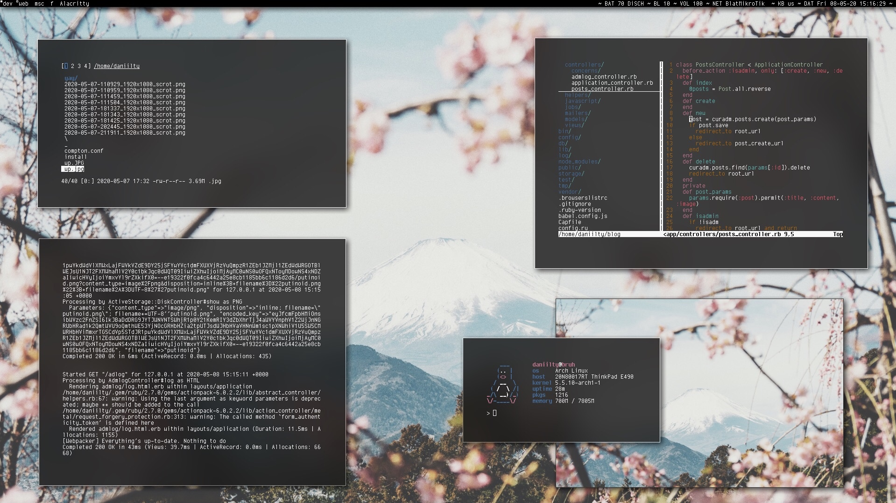

<h1 align="center">Here's the setup</h1>
</img>
<h2 align="center">Stuff you'll need:</h2>
<ul> 
<li><a href="https://github.com/tryone144/compton">Compton-tryone</a></li>
<li><a href="https://github.com/turquoise-hexagon/cherry">Cherry font</a></li>
<li><a href="https://github.com/davatorium/rofi">Rofi</a></li>
<li><a href="https://github.com/joestandring/dwm-bar">Useful scripts for setting the system info right into the bar</a></li>
</ul>
